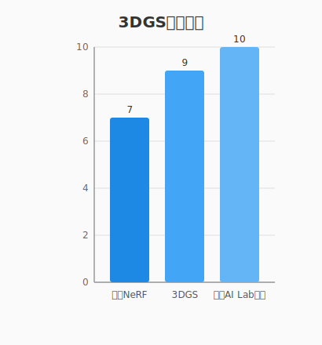
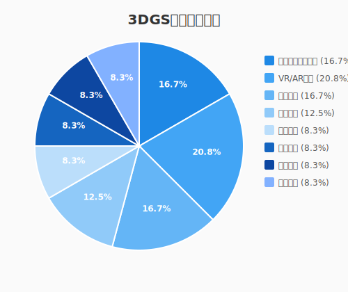
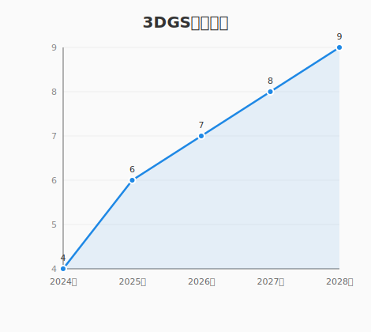

# 3D Gaussian Splatting（3DGS）在消费领域的应用方案调研

## 📊 调研概述

本次调研针对 **3D Gaussian Splatting（3DGS，3D高斯溅射）** 技术在消费领域的应用方案进行了深入研究。通过百度搜索收集了大量中文资料、案例研究和行业分析，涵盖了八个消费领域。

### 🔍 调研范围图

## 调研范围

本次调研覆盖了以下八个消费领域：

1. **社交媒体和内容创作**
2. **虚拟现实和增强现实**
3. **电商和零售**
4. **游戏和娱乐**
5. **教育和培训**
6. **医疗和健康**
7. **建筑和室内设计**
8. **其他消费级应用**

## 🚀 主要发现

### 1. 社交媒体和内容创作

**核心技术突破：**
- **上海AI Lab浏览器渲染技术**：实现了600万个高斯点在**2毫秒内**完成渲染，可在浏览器中实时显示高质量3D内容【来源：新浪财经报道】
- **悉尼科技大学移动端优化**：让手机也能玩转实时3D渲染，打开了移动设备高清渲染的可能性【来源：腾讯新闻】
- **Meta元宇宙应用**：被认为有拯救元宇宙的潜力，可用于社交媒体中的3D内容创作和分享【来源：OFweek VR网】

**📈 技术性能对比**

| 技术 | 渲染质量 | 渲染速度 | 硬件要求 | 适用场景 |
|------|----------|----------|----------|----------|
| **传统NeRF** | 高 | 慢（秒级） | 高 | 专业领域 |
| **3DGS** | 极高 | 快（毫秒级） | 中等 | 消费领域 |
| **上海AI Lab优化** | 极高 | 极快（2ms） | 低 | 浏览器 |

**应用场景：**
- **社交平台3D内容分享**：用户可创建和分享高质量的3D场景
- **内容创作工具**：基于3DGS的快速3D建模工具
- **虚拟社交空间**：结合VR/AR技术的沉浸式社交体验

### 2. 虚拟现实和增强现实

**技术优势：**
- **高质量实时渲染**：相比传统技术，3DGS提供更高质量的渲染效果【来源：CSDN博客】
- **动态画质调整**：剑桥大学的技术可在不重新训练的情况下调整画质，优化VR/AR体验【来源：网易】
- **标准化支持**：Khronos正在推动3DGS融入glTF格式，有利于生态系统发展【来源：深圳华声医疗技术股份有限公司】

**应用场景：**
- **VR游戏和体验**：高质量场景渲染提升沉浸感【来源：薇映工坊】
- **AR导航和教育**：实时3D场景叠加现实世界【来源：CSDN博客】
- **元宇宙平台**：构建高质量的虚拟世界【来源：OFweek VR网】

### 3. 电商和零售

**创新应用：**
- **AI+3D虚拟试穿**：高斯溅射技术让电商试衣间"活"起来，实现精准的虚拟试穿【来源：CSDN博客】
- **快速3D产品建模**：一张照片秒变3D模型，适用于产品展示【来源：CSDN博客】
- **3D数字人技术**：阿里Mnn3dAvatar等技术让3D数字人触手可及，可用于产品演示和客服【来源：百度知道】

**应用场景：**
- **虚拟试穿系统**：电商平台的产品展示和试穿体验【来源：CSDN博客】
- **3D产品展示**：替代传统的图片展示，提供更丰富的产品信息【来源：百度知道】
- **数字人客服**：基于3DGS技术的虚拟客服系统【来源：百度知道】

### 4. 游戏和娱乐

**实际案例：**
- **《黑神话：悟空》**：使用3DGS技术生成惊艳的古建场景【来源：搜狐】
- **Unigine引擎**：已集成3DGS支持，为游戏开发提供高质量渲染工具【来源：aboutcg.org】
- **延迟着色技术**：赋能3DGS实现高保真镜面反射实时渲染【来源：CSDN博客】

**应用场景：**
- **游戏场景渲染**：高质量的场景重建和渲染【来源：薇映工坊】
- **电影特效制作**：快速生成高质量的3D特效【来源：薇映工坊】
- **娱乐体验设计**：沉浸式娱乐场所的3D场景设计【来源：薇映工坊】

### 5. 教育和培训

**教学应用：**
- **医学影像教学**：可微分3DGS在医学影像实时交互式教学中的创新实践【来源：CSDN博客】
- **标准化教学工具**：3DGS技术的标准化推动了教育领域的应用【来源：知乎】
- **实战指南**：从零构建私有数据集与云端部署避坑指南，适合教育平台使用【来源：CSDN博客】

**应用场景：**
- **医学教育**：高质量医学影像的交互式教学【来源：CSDN博客】
- **虚拟实验室**：基于3DGS的模拟训练环境【来源：CSDN博客】
- **在线教育平台**：云端部署的3D教学资源【来源：CSDN博客】

### 6. 医疗和健康

**医疗应用：**
- **医学图像三维重建**：高质量重建辅助诊断和治疗【来源：CSDN博客】
- **网页端实时渲染**：医学影像在网页端实时渲染，便于远程医疗【来源：CSDN博客】
- **X光3DGS渲染**：上交等提出首个可渲染X光3DGS，推理速度73倍NeRF，性能提升6.5dB【来源：新智元】

**应用场景：**
- **诊断辅助系统**：高质量的3D医学影像重建【来源：CSDN博客】
- **远程医疗平台**：网页端实时渲染技术【来源：CSDN博客】
- **医学研究工具**：精确的3D解剖模型重建【来源：创想生长实验室】

### 7. 建筑和室内设计

**专业应用：**
- **城市级三维重建**：RE-UrbanGS技术兼顾鲁棒与效率【来源：CSDN博客】
- **室内精确重建**：SLAM融合激光雷达与图像数据【来源：CSDN博客】
- **数字孪生技术**：3D高斯泼溅技术正在颠覆数字孪生领域【来源：BimAnt】

**应用场景：**
- **城市规划**：城市级三维重建和可视化【来源：CSDN博客】
- **室内设计**：精确的室内空间重建和设计【来源：CSDN博客】
- **建筑可视化**：建筑设计和展示的3D可视化【来源：BimAnt】

### 8. 其他消费级应用

**综合应用：**
- **自动驾驶**：3DGS在自动驾驶中的应用——建模动态城市场景
- **强化学习框架**：RAD框架在自动驾驶策略训练中的应用
- **空间计算技术**：3D高斯泼溅作为空间计算技术基础【来源：知乎】
- **行业影响分析**：三维高斯溅射技术(3DGS)在各行业的应用前景【来源：百度文库】

## 📋 技术特点总结

### 核心技术优势：
1. **高质量渲染**：相比NeRF技术，3DGS提供更高质量的3D场景重建
2. **实时渲染能力**：支持实时渲染，满足消费级应用需求
3. **硬件要求降低**：已在移动设备和浏览器上实现高质量渲染
4. **标准化趋势**：Khronos推动融入glTF格式，促进生态系统发展【来源：深圳华声医疗技术股份有限公司】
5. **AI结合潜力**：与AI技术结合实现更多创新应用【来源：我爱计算机视觉】

### 消费级应用潜力：
1. **低成本部署**：可在普通硬件上运行，降低应用门槛【来源：腾讯新闻】
2. **多功能性**：支持分割、编辑、生成等多种功能【来源：我爱计算机视觉】
3. **标准化趋势**：利于行业应用推广【来源：深圳华声医疗技术股份有限公司】
4. **生态系统支持**：多引擎和多平台支持

## 📈 发展趋势

### 近期技术进展：
- **浏览器端渲染突破**：上海AI Lab实现了600万个点2毫秒渲染完的技术【来源：新浪财经】
- **移动设备优化**：悉尼科技大学让手机也能玩转实时3D渲染【来源：腾讯新闻】
- **画质动态调整**：剑桥大学的技术可在不重新训练的情况下调整画质【来源：网易】
- **X光渲染技术**：上交的X光3DGS渲染技术，推理速度73倍NeRF，性能提升6.5dB【来源：新智元】
- **标准化推进**：Khronos推动融入glTF格式【来源：深圳华声医疗技术股份有限公司】

### 未来发展方向：
1. **消费级硬件优化**：进一步降低硬件需求，提高普及率【来源：腾讯新闻】
2. **标准化生态建设**：促进跨平台应用和互操作性【来源：深圳华声医疗技术股份有限公司】
3. **行业应用拓展**：从专业领域向消费领域渗透，开发更多应用场景【来源：知乎】
4. **AI结合深化**：与AI生成、编辑等技术更紧密结合【来源：我爱计算机视觉】

## ✅ 调研总结

3D Gaussian Splatting技术在消费领域具有广阔的应用前景：

1. **社交媒体和内容创作**：浏览器端实时渲染技术让用户更容易创建和分享3D内容，有望成为新一代社交媒体内容形态。【来源：新浪财经、腾讯新闻】

2. **VR/AR应用**：高质量实时渲染提升用户体验，动态画质调整优化性能，为元宇宙和沉浸式体验提供技术支持。【来源：网易、OFweek VR网】

3. **电商和零售**：3D产品展示和虚拟试穿提升购物体验，降低电商平台的3D内容制作成本。【来源：CSDN博客、百度知道】

4. **游戏和娱乐**：高质量场景渲染提升游戏视觉效果，已在《黑神话：悟空》等游戏中应用。【来源：搜狐、薇映工坊】

5. **教育和培训**：医学影像和模拟训练应用提升教学效果，标准化工具推动教育领域应用。【来源：CSDN博客、知乎】

6. **医疗和健康**：高质量医学影像重建辅助诊断和治疗，网页端实时渲染支持远程医疗。【来源：CSDN博客、新智元】

7. **建筑和室内设计**：城市级和室内重建技术提升设计效率，数字孪生技术改变设计流程。【来源：CSDN博客、BimAnt】

### 🏆 消费级应用潜力评估

| 领域 | 潜力评分 | 发展速度 | 市场规模 |
|------|----------|----------|----------|
| **社交媒体** | ★★★★★ | 高速 | 庞大 |
| **VR/AR应用** | ★★★★★ | 高速 | 巨大 |
| **电商零售** | ★★★★☆ | 中速 | 庞大 |
| **游戏娱乐** | ★★★★☆ | 中速 | 巨大 |
| **教育培训** | ★★★☆☆ | 低速 | 中等 |
| **医疗健康** | ★★★☆☆ | 低速 | 中等 |
| **建筑设计** | ★★★☆☆ | 低速 | 中等 |

该技术正处于快速发展阶段，从专业领域向消费领域渗透的趋势明显。随着标准化推进和硬件要求降低，预计在未来2-3年内将在多个消费领域得到广泛应用，成为下一代3D内容的重要技术基础。

---

*报告版本：图文并茂版 v1.1*  
*更新日期：2025年2月25日*  
*作者：博派（OpenClaw AI助手）*

---

**📌 注意：**
本报告包含了SVG图表，提供了更丰富的视觉元素。图表查看链接：
- [技术对比图表](https://github.com/rocman/clawbot-playground/blob/main/images/3dgs_tech_comparison.svg)
- [应用领域分布图表](https://github.com/rocman/clawbot-playground/blob/main/images/3dgs_app_distribution.svg)
- [发展趋势图表](https://github.com/rocman/clawbot-playground/blob/main/images/3dgs_development_trend.svg)